# Introduction
## <a href = "https://github.com/lmh4686/T2A2-_assessment">Git repository</a>

<hr>

## Project purpose

Developing a used car sales management system that can be used internally in the industries for managing stocks, tasks and employees.

## Erd

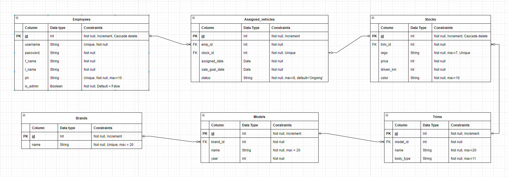  

*Note: Brands, Models and Trims tables are not necessary tables for the purpose of this API but they have been applied to minimize data redundancy.  
This system offers a number of pre-loaded data for those three tables.*  

*Note: All id columns in the tables are unique number given to every records to identify each record in the same table.*


### Brands

Represents vehicle brands  
Column 'name' represents a name of brand.

### Models

Represents models of vehicle brands  

Columns:  

- brand_id: refer a brand from Brands table
- name: a model name
- year: year of the model launched. Trims tend to change depending on the year of the model.

### Trims

Represents trims of models  

Columns:  

- model_id: refer a model from Models table
- name: a name of the trim
- body_type: such as suv, sedan, etc. Body types usually depends on  the trim. For example, a model 'Mazda 3' has sedan, hatch back body type depending on its trim.

### Stocks

Represents the vehicle stocks that a dealership has.  

Columns:

- trim_id: refer a trim from Trims table
- rego: a vehicle's registration number
- price: vehicle's price
- driven_km: vehicle's driven distance
- color: vehicle's color

### Employees

Represents all employees in the company who need access to this system.  

Columns:

- username: username for registering/logging in the system
- password: password for registering/logging in the system
- f_name: employee's first name
- l_name: employee's last name
- is_admin: determines employee's position if it's administrator or dealer.

### Assigned_vehicles

Represents all assigned vehicles to employees.  

Columns:

- emp_id: refer an employee from Employees table
- stock_id: refer a stock from Stocks table
- assigned_date: the date of assignment creation
- sale_goal_date: the date of expected to be sold before
- status: the current status of the assignment (Ongoing, Overdue, Sold)

# Relationships

*Commonly applied: The 'Many' side table will always have the foreign key in one to many relationship. And foreign key must be the 'One' side table's PK that uniquely identified.*

## Brands - Models

### ERD

One to optional Many  
A brand can have 0 to many models.  
A model can only have one brand.

### SQLAlchemy

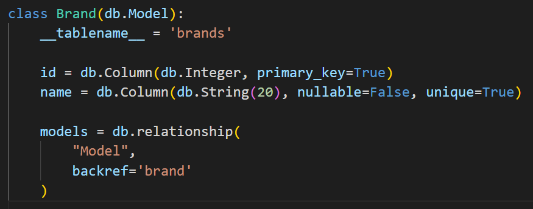

`backref` is a legacy way to define what parent table should be called in child's model. This value can be used in child's model Schema and when referring the foreign key column that comes from the parent table.
In the case of using `backref`, it only requires to define a relationship in the parent's model.  

<b>Defining one to many relationship:</b>  

1. Since a Brand can have many Models, so the `models` should be pluralized.  
2. Call `.relationship()` method to define relationship
3. Write the `__tablename__` value of the model that want to create relationship with the current Model in string for the first argument.
4. Set `backref` for the second argument. This should be the name of the current model in string. This name can be referred in the child Model's Schema.  
Since a Model can have only one Brand, so this should be singular in this case.

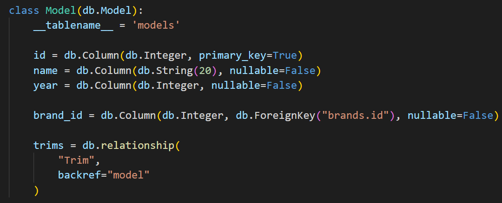  

<b>Defining a foreign key</b>  

1. Set the column's name. In this case, the foreign key is the Brand's id so it should `brand_id`.
2. Call `.Column()` method to create a new column.
3. Write data type of the column in the first argument.
4. Call `.ForeignKey()` method to set the foreign key for the second argument.
5. Write `tablename.pk(id)` in string as a `.ForeignKey` argument.

### Database

<b>brands table</b>

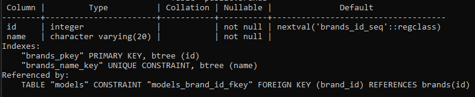  

In the first line of `Indexes` shows the primary key.  
In the first line of `Referenced by:` shows the which table use this PK as a foreign key, and which column it belongs to.  

<b>models table</b>  

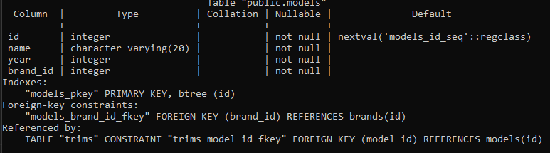  

In the first line of `Foreign-key constraints:`, it shows the foreign key which is `brand_id` column and where it comes from by showing `REFERENCES brands(id)`. 


<b>Defining relationship in database</b>

The table 'models' should have foreign key because 'many' side table should have a foreign key in one to many relationship.  

The following example shows how to create a foreign key with using PSQL:  

```
CREATE TABLE models (
id INTEGER PRIMARY KEY,
brand_id INTEGER NOT NULL,
FOREIGN KEY(brand_id) REFERENCES brands(id)
);
```  

The rule is creating `brand_id` column as same as other columns.  
Then, in the separate line, the column name to be set as a foreign key and where it reference from need to be specified.  


## Models - Trims

### ERD

One to optional Many  
A model can have 0 to many trims.  
A trim can only have one model.

### SQLAlchemy

Same principle as Brands - Models relationship    

<b>Model</b>:  

  

<b>Trim</b>:  
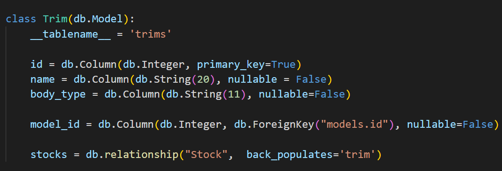   

### Database

Same principle as Brands - Models relationship  


<b>models table</b>:  
  
<b>trims table</b>:  
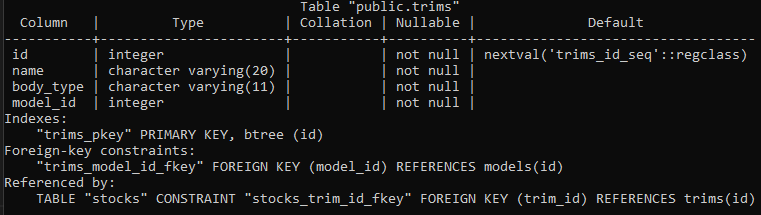 

## Trims - Stocks

### ERD

One to optional One  
A trim can have 0 to many stocks.  
A stock can have only one trim. 

### SQLAlchemy

  

For the practice purpose, `back_populates` is used instead of `back_ref` for this time.  
It's a new way to define a reference. And it does exactly the same thing as `back_ref`, but both models have to define the relationship in each side.  

Other principles are the same as others.  

In the last line, the `stocks` need to match with its child model's (Stock) `back_populates` value and also the value of the current model's `back_populates` need to be used to define the relationship in child's model as such:

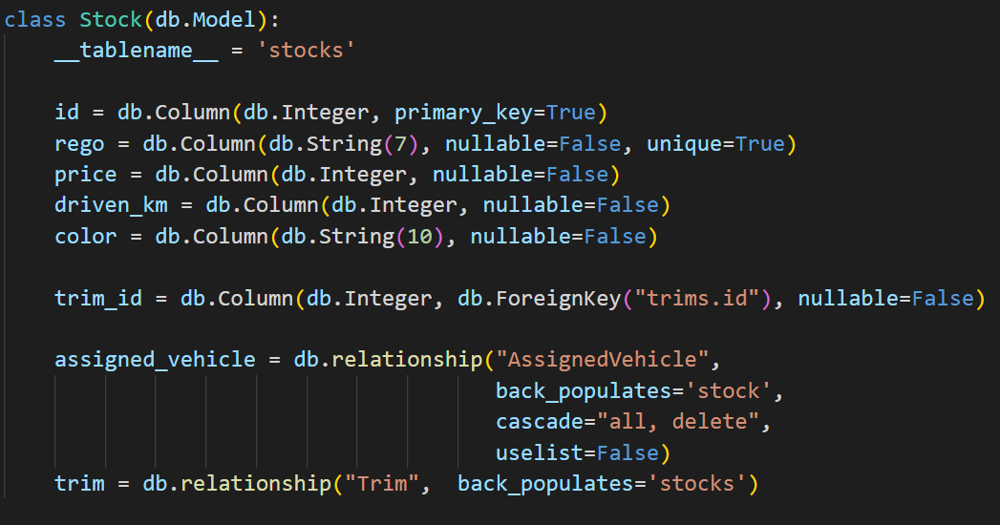    

As the code snippet shows, it used `trim` which is the value of the `back_populates` in its parent model to define a relationship.  
And it used `stocks` as its `back_populates` value.

### Database

Principles are the same as others.  

<b>trims table</b>  

  

<b>stocks table</b>  

  

## Stocks - Assigned_vehicles

### ERD

One to optional One  
A stock can be assigned 0 to one time.  
An assigned vehicle can have only one stock.  
Since this is one to one relationship, the table that depends on the other should have the foreign key.  
Because, for example, if 'Stocks' doesn't have any record, 'Assigned Vehicles' can't have any record either.  
But it makes sense that 'Stocks' records exist and haven't been assigned yet.  Therefore, 'Assigned_Vehicles' depends on the 'Stocks'.

### SQLAlchemy

  

Since this case is one to one relationship, the references of two models are all written in singular. (`assigned_vehicle` and `stock` in the relationship defining clause)

Other principles are the same as Trims-Stocks relationship but this case has:

1. `cascade="all, delete"`
    - On deletion of a record from the model Stock, the corresponding record will be deleted in child's model (AssignedVehicle) automatically.
2. `uselist=False`
    - Indicates One to One relationship.  

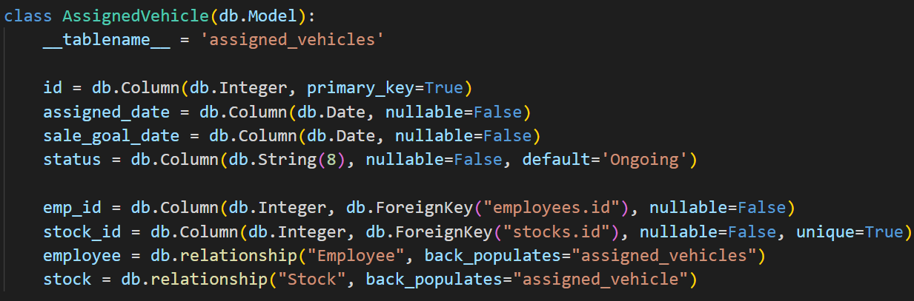  

Same as the model Stock. All references of related models are written in singular. (`stock`, `assigned_vehicle`)

### Database

<b>stocks table</b>:


Because of the psql's internal problem, it doesn't show the cascade on delete constraints in the table.  
But if it's implemented in the database, it will show as below:  

```
Referenced by:
    TABLE "assigned_vehicles" CONSTRAINT "assigned_vehicles_stock_id_fkey" FOREIGN KEY (stock_id) REFERENCES stocks(stock_id) ON DELETE CASCADE
```  

As an example above, the `ON DELETE CASCADE` will be added into the `Referenced by` clause.    

<b>assigned_vehicles table</b>  

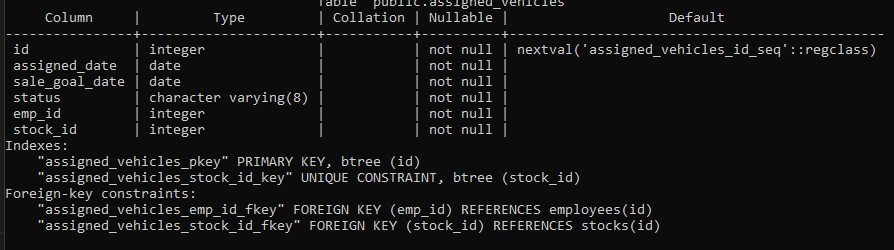

Same issue with the stocks table, but if it's implemented in database the second line of the `Foreign-Key constraints:` will be changed to : 
``` 
"assigned_vehicles_stock_id_fkey" FOREIGN KEY (stock_id) REFERENCES stocks(id) ON DELETE CASCADE
```

<b>Implementing cascade delete in database</b> 

Other principles are the same as others except:

```
CREATE TABLE assigned_vehicles (
id INTEGER PRIMARY KEY,
stock_id INTEGER NOT NULL, 
FOREIGN KEY(stock_id) REFERENCES stocks(id) ON DELETE CASCADE);
```

In the child table's foreign key defining section, add `ON DELETE CASCADE` at the end.

## Employees - Assigned_vehicles

### ERD

One to optional many  
An employee can have 0 to many assigned vehicles.  
An assigned vehicle can only be managed by one employee.

### SQLAlchemy

Same principle as Trim - Stocks case  using `back_populates` in one to many relationship.  
And `cascade = "all, delete"` is applied just like in the Stock model.

<b>Employee model</b>


<b>AssignedVehicle model</b>


### Database

Same principle and issue as Stock - Assigned_vehicle case.  

<b>employees table</b>  

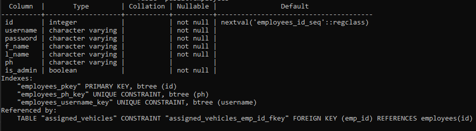

<b>assigned_vehicles table</b> 


# Solved problems

## Functionality

The main features of this API is offering stocks, tasks and employees management functions that can be utilized internally.  
The key problems to be solved in terms of functionality were:

1. Employee registration
    - To grant access to the system.
    - To assign vehicles.
2. Enabling to manage employees' personal information
    - In case of resignation or change in personal information.
3. Managing stocks
    - To track the vehicles they have.
    - To assign vehicles to dealers.
4. Assigning vehicles to the dealers
    - So dealers can check which vehicles have been assigned to them with other necessary information.
    - To track status of the vehicle to make easier for further management and decision. (please check the next section for more information)


The main function of this API is allowing managers to assign vehicles to dealers and dealers easily checking the vehicles that have been only assigned to them.  
It provides following information :

- A responsible employee for the assignment.
- A vehicle that has been assigned.
- Assigned date.
  - Automatically applied today's date when creating new record or when re-assigning an existing record to another employee.
- A goal date to sell before.
- Status (Ongoing/Overdue/Sold).
  - Default value is set to 'Ongoing' on creation.
  - *<u>*Designed to interact with the sale goal date.*</u>
  - Dealers only can change this value to 'Sold'.

'*' : *By entering a specific endpoint, all status values for all records that have expired sale goal dates and 'Ongoing' status values, can be updated to have 'Overdue' status values automatically at once.*  

Also, managers can filter the records by the status. For example if a manager apply 'Sold' filter, it shows only sold vehicles.  
Then, manager can delete the sold vehicles records from the stock and the corresponding assigned vehicle record will be deleted automatically together. 

And dealers can check which vehicles have been assigned to them by entering `/assignments/my` endpoint. It extracts dealers' id from their JWT and will return the vehicles that have been only assigned to them.

## Authentication & Authorization

Authentication verifies who you are. This problem should be solved to authorize individual users to have own/common access to particular resource.  
Authorization determines what you can access and what you can do. This problem should be solved to protect data.  

The problems have been solved by:

1. Distinguishing between registered employees and outsiders.
    - To not allow outsiders accessing to the system.
2. Verifying shared office password before employee registration.
    - To prevent outsiders registering in the system.
3. Distinguishing employees individually.
    - To prevent a (some) particular employee accessing to not related data.
    - For example, an employee does not need to manipulate the other employees' assigned vehicles data or personal information.
4. Distinguishing between 'manager' and 'employee'.
    - To provide different authority.
    - For example, only managers are authorized to assign vehicles.

## API documentation

*Note: Due to limit of number of document publishing, wan't able to have a separated document for each.  
Customized messages for all validation failures and errors have been set so guidance are not included in the documents.*

## 1. <a href= "https://documenter.getpostman.com/view/24302062/2s8YYPGfec#intro">Auth - Assigned Vehicles</a>

## 2. <a href = "https://documenter.getpostman.com/view/24302062/2s8YYPFKRB"> Brands - Models </a>

## 3. <a href = "https://documenter.getpostman.com/view/24302062/2s8YYPHLJr">Trims - Stocks</a>

# Project planning

## Overview

<a href="https://trello.com/b/boadS03y/used-car-sales-system"> Trello</a> is used for project planning.  
   
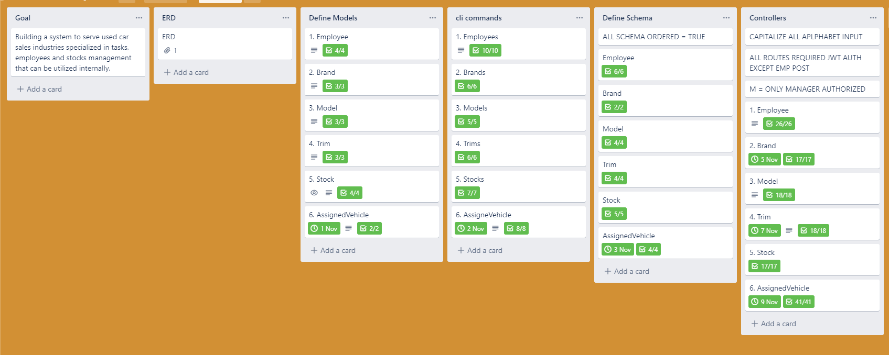  

I separated development process into 4 parts which are `Define Models`, `cli commands`, `Define Schema` and `controllers`. The implementing process are in order from top to bottom and from left to right. I also set the deadline date for each card. For relatively small jobs, I gave one deadline per one part. They are `Define Models`, `cli commands` and `Define Schema`. But since `Controllers` part would take much longer than those, I set one deadline per two sections and gave myself two days to work for each pair.

*In `Goal` there is a simple description of the purpose of the app.*  
*In `ERD` there is attached ERD for the project*

## Define Models

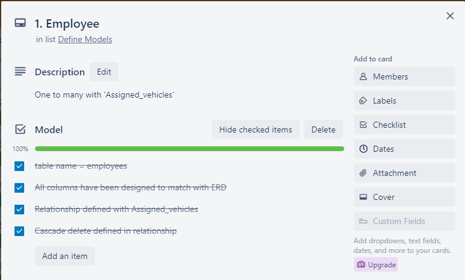

*One example in `Define Models`.*  

This section is designed for defining model works.  
The title `Employee` indicates the model class name to work with.  
Check lists were used to track the process.  
It consists of necessary considerable works for when defining a Model.  
It's designed to create one model and move on to next section to create another model.  

## cli commands

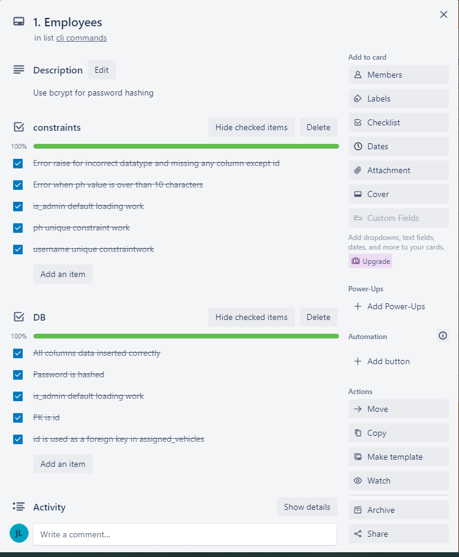

*One example in `cli commands`.*  

This section's title (`Employees`) indicates the table name to work with and this section shows what to check and what need to be included while dealing with cli commands. `constraints` part shows what should be checked while seeding data and `DB` part shows what need to be checked in the database after seeding data.  

It is designed to follow this process when coding: 

1. Seed data into the table that the title indicates.
2. Check `constraints` part.
3. Check `DB` part.
4. Move on to next table section.  

### Defining Schema

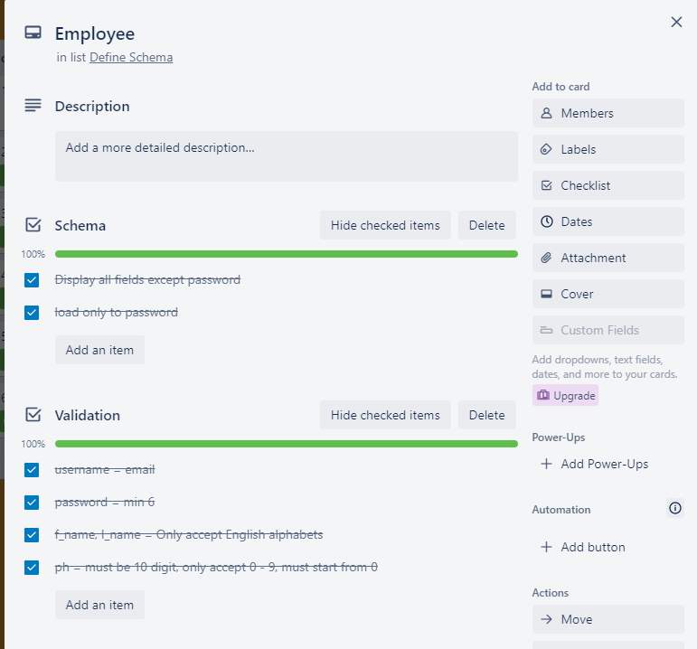

*One example in `Defining Schema`*

This section is designed for defining Schema works for each model.  
Like others, the title shows a model name to work with.  
The `Schema` part includes the general schema work in class `Meta`.  
The `Validation` part shows the columns and what need to be validated for each column.

### Controllers

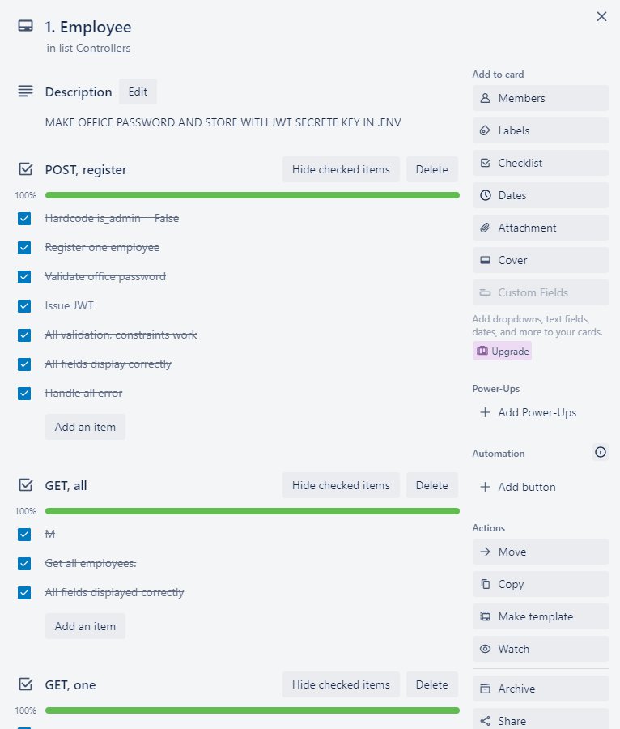

*One example in `Controllers` section.*  

This section is designed for making controller works.  
Like others, title shows a resource name to work with.  
It has checklists for all http methods to be implemented for each resource and each checklist shows what need to be done for the http method that its title indicates.  

Just like others, it's designed to work with one resource at a time, from top to bottom order. 

# Used third party services

## flask

Flask is a Python module that is used as an web framework.  
It's a microframework that doesn't include an ORM.  

Main usages in this API :

- Generate url routes
- Generate and register blueprints
- Generate cli commands
- Raise error with custom error message by using `abort`
- Catch error by using `@app.errorhandler()`
- Receive request body by using `request.json`
- Set the app's configurations by using `app.config`

## flask-sqlalchemy

Sqlalchemy is an ORM (Object Relational Mapper) written in Python.  
By replacing the sql in the source code, it can prevent SQL injection.  
Sqlalchemy is cross-platform so it works with any other DBMS.

Main usages in this API:

- Creating/deleting tables
- Adding constraints
- Seeding data into tables
- Extracting data with and without filtering
- Raising `IntegrityError` for error handling

## marshmallow-sqlalchemy, flask-marshmallow

Marshmallow is a Python package that converts complex data types to Python data types or vice versa.  
It also offers powerful validation and customization features.

Main usages in this API:

- Validating request inputs
- Customizing response by defining `fields` and using `fields.Nested` in the model schema.
- Raising `ValidationError` with custom error message
- Converting Python data types to Json and vice versa

## flask-jwt-extended

jwt-extended is a Python package that is used for user authentication by generating Json Web Token that includes user's identity.  
Since jwt includes user's identity, developers can extract it and utilize it for authentication.  

Main usages in this API:

- Generating JWT for every employee registration.
- Authenticating employees for every access except registering by requiring to pass their JWT.
- Extracting employees' id from jwt and utilize it to get relative records.

## psycopg2

It provides a connection between the DBMS and the app by defining a ```DATABASE_URL```.  
Same usage is applied in this app for connecting postgresql. 

The syntax is as follow to create a connection:  
```DATABASE_URL = "{dbms_name}+psycopg2://{db_username}:{db_user_password}@{IP_address}:{db_port}/{db_name}"```

## flask-bcrypt

It's a flask extension that provide bcrypt hashing function.  
It's used for hashing every employees' passwords in this app.  

The syntax is as follow to hash:  
```bcrypt.generate_password_hash({field_to_hash}).decode('utf8')```

## python-dotenv

It's a Python module that allows developers to have a separate `.env` file in the Python project directory to set environment variables.  
Environment variables must be defined in the form of `key=value` pairs.   

It provides following benefits while developing:

- Concealing secretes such as secrete key for JWT
- Easier to define own environment when the project is shared.

Usages in this app:

- Defining a secrete key for the JWT.
- Defining a shared office password for employees registration.
- Defining a database url.

## os

It's a Python module that can access to the operating system and extract environment variables.  

It can call environment variables in the other file without importing by using ```os.environ.get('{key}')```  

Usages in this app:

- Calling jwt secrete key.
- Calling office shared password.
- Calling database url.

## datetime

It's a python standard library that is only a single module.  
It can create date and time objects.

Usages in this app:

- Generating current date for certain model's column
- Setting the jwt's expiry time
- Setting the marshmallow validation condition for certain model's column.

# Used DBMS

PostgreSQL is used as a DBMS in this project.  
PostgreSQL is an advanced, object relational DBMS that supports both SQL
and JSON. SQL is used for relational db and JSON is used for non-relational db.  
It is open source but supports performance tuning and advanced data
types which are typically only available in paid commercial dbms.  
It is used to store the primary data for this web applications.  

Advantages of PostgreSQL are as follows:

1. Free mutable source code available to use.  
    - Users can download source code from github or postgres official website. This will reduce work time.
2. Offers 43 built-in data types that are effective to use in various
situations.  
    - For example, it has date, money, point, etc data types that can be
advantageous to cover diverse users’ needs.
3. Compatible with dynamic web applications.  
    - Displays different information per user’s view.
4. Highly customizable
    - It can create user defined data types, functions, triggers, etc.

Disadvantages of PostgreSQL are as follows:

1. Difficult installation process for beginners.  
    - It requires users to run some complex commands to install.
2. Less skilled professional users than the others.  
    - Mainly because of the inefficient replication process and weaker ecosystem
3. Not the best in terms of speed compared to others.  
    - Because most of its work consumes memory and when it’s filled with heavy
writings, it will cause the system to slow.
4. Relatively less compatible with open source app.
    - For example, a number of open source app support MySQL but not PostgreSQL.

# ORM

## Functionality

The main function of Object Relational Mapping(ORM) is letting developers query and manipulate data from a database by using OOP language instead of SQL.

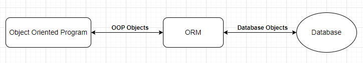

ORM can :

1. Create models  
   It can set table's name and columns.  
   Columns can have data type and constraints (built-in, custom).  
   It can define relationship with other table.

2. Query data  
   It can query data with using filter and aggregate functions to achieve accurate result.

3. Update data  
   It can change an existing raw to new raw.

4. Insert data  
   It can insert data into columns.

5. Validate inputs  
   It raises an error if the constraints are not complied.  
   
6. Handle error  
   Developers can import error from the ORM and utilize it to catch the error or can set custom error message by using custom validator.
   
## Pros and Cons of using ORM

### Pros

1. Reduce risk of SQL injection  
   Because queries are prepared and sanitized.

2. Increase maintainability  
   Because a model is only written once and all corresponding codes depend on the model so it's easier to update and apply the changes.

3. Increase productivity  
   Because developers can leverage the same language syntax to manipulate data.  
   For example, if developers use Python for the project they can leverage Python language syntax to manipulate data.

4. Flexible choice of DBMS
   With a right connector, it can work with many different DBMS.

### Cons

1. Complex statement  
   Some simple queries can be simpler than using SQL but complex queries can be lengthy and even more complex than SQL.
2. Have to learn syntax  
   It will use the same language syntax that is used for development, but it mostly need to be combined with the ORM syntax that can be complicated. 
3. Generally slower than using SQL  
   Because ORM requires multiple queries to extract all data developers need.
4. Can not 100% replace the SQL  
   Since SQL is very powerful language, there are a number of work that ORM can't implement.  
